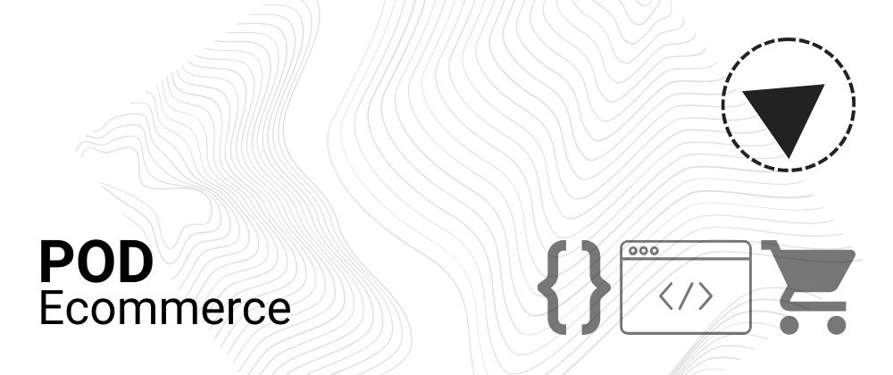

# Welcome to Print on Demand (POD) Ecommerce

**Empowering Creativity through Innovative Integration**

We extend a formal welcome to the Print on Demand (POD) Ecommerce GitHub organization, a bastion of pioneering developers and visionary entrepreneurs dedicated to reshaping the landscape of ecommerce through seamless integration with Print on Demand Services.

At POD Ecommerce, our overarching objective is to equip enterprises and individuals with the tools needed to transform imaginative concepts into tangible, marketable merchandise. Whether you identify as an artist, a brand owner, or a purveyor of online stores, our web-based solutions stand as a conduit to simplifying the entire POD journey, from concept inception to product delivery.

### **Key Strategic Pillars**

🌐 **Integration**: Our commitment lies in the development of robust, user-centric web solutions that effortlessly harmonize with industry-leading Print on Demand Services. Our goal is to enable the swift establishment of your POD-powered online store.

🖌️ **Customization**: Acknowledging the distinctiveness of each business, our solutions are designed to be adaptable, allowing you to configure your POD ecommerce platform to be an embodiment of your brand identity and corporate vision.

🌟 **Community**: Beyond serving as a repository of code, our organization thrives as a dynamic community where developers, designers, and ecommerce enthusiasts convene to exchange ideas, foster collaboration on transformative projects, and extend unwavering support.

📚 **Education**: Knowledge is the cornerstone of success. Our resources include an expansive library of tutorials, guides, and best practices, aimed at imparting vital insights for navigating the ever-evolving landscape of POD ecommerce.

### **Embrace the POD Ecommerce Revolution**

Collectively, we are endeavoring to redefine the future of ecommerce. Whether you are an adept developer seeking to contribute to cutting-edge initiatives or an eager newcomer aspiring to broaden your horizons, POD Ecommerce is your haven.

Harness your potential, peruse our repositories, and become a part of the journey to mold a more accessible, vibrant, and thrilling POD ecommerce environment. Together, we shall reshape the way commerce unfolds, one print at a time.

You are cordially invited to be part of a realm where ideas metamorphose into designs, and designs materialize into reality. 🌈✨

[Explore Our Repositories](https://github.com/POD-E-Commerce)
